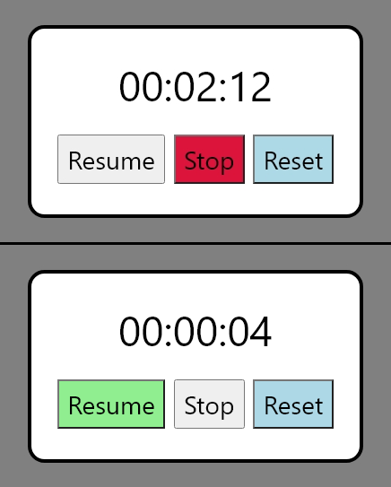
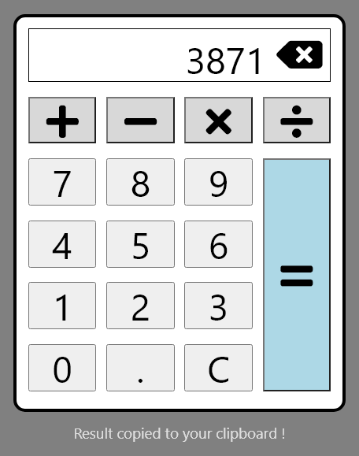
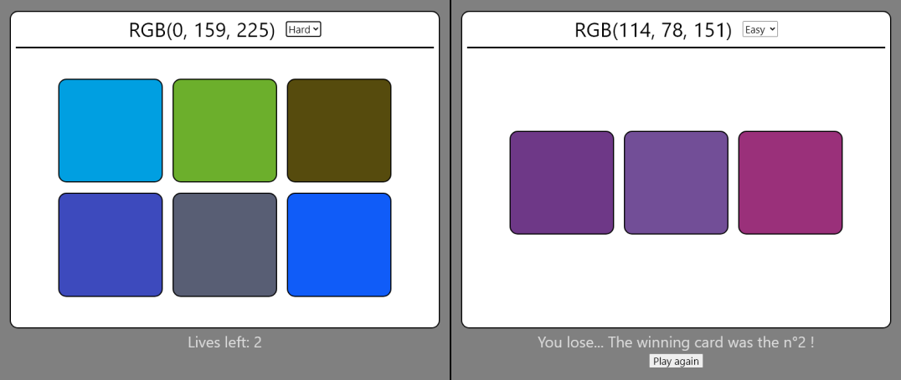

# Workshop JS - Introduction au JavaScript
Il y avait bien quelque chose avant React.. :shipit:

## Setup
- Installer [VS Code](https://code.visualstudio.com/download) (ou sur le shop de votre OS)
- Activer l'extension "Live Server" de Ritwick Dey
- Utiliser le dossier ["blank-project"](./blank-project/)

## Introduction
- Pourquoi faire du JavaScript ?
- Se renseigner avant de commencer:
  - Le "non-typé"
  - Les opérateurs
  - Les fichiers et leur rôle dans un projet
- Tester JavaScript dans une console web
- [Lancer un projet](https://streamable.com/83nsgw)
- [Les boutons et getElement](https://streamable.com/6goi9z)
>:warning: Tu n'as besoin d'installer ni package ni lib de tout le workshop

## Exo n°1 - Chronomètre
Crée un chronomètre avec les fonctionnalitées basiques:
- Start
- Stop
- Reset

>:grey_exclamation:	N'oublie pas de styliser un minmum ta page avec CSS

## Exo n°2 - Calculatrice
Crée une calculatrice avec les opérateurs et features de base:
- Additionner
- Soustraire
- Multiplier
- Diviser
- Reset

## Exo n°3 - "Guess the color"
Crée un jeu dont le but est de déterminer la couleur donnée en RGB.
Le jeu en lui-même aura 2 difficultées:
- Easy: 3 propositions et 1 vie
- Hard: 6 propositions et 2 vies

>:grey_exclamation:	N'hésite pas à ajouter d'autres features !

## Exo n°4 - Components
_Les web components sont très importants dans le développement Front. Ils permettent de factoriser efficacement son code, le rendant plus lisible et plus facilement modifiable.
Aujourd'hui avec React, Angular ou d'autres frameworks, créer un component est très simple et très rapide. Mais comment faire en JS "pur" ?_

Crée un component "Counter" avec comme propriétés:
- Le taux d'incrémentation (+1 ou +5 ou -10)
- Le label (nom/titre) du counter
>:grey_exclamation:	Si tu en as en tête, crée plus de props ou un tout autre component !
