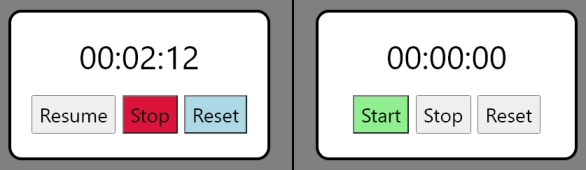

# Workshop JS et React
Commençons par l'avant-React.. :shipit:

## Setup
- Installer [VS Code](https://code.visualstudio.com/download)
- Y activer l'extension "Live Server" de Ritwick Dey
- Utiliser un dossier ["blank-project"](./blank-project/) correspondant au language utilisé pour chaque éxo

## Introduction
- Pourquoi faire du JavaScript (JS) ?
- Pourquoi React et qu'est-ce-que c'est par rapport à JS ?
- Se renseigner avant de commencer:
  - Le "non-typé"
  - L'opérateur de comparaison "==="
  - Les fichiers et leur rôle dans un projet
- [Lancer un projet](https://streamable.com/83nsgw)
- [Les boutons et getElement](https://streamable.com/6goi9z)
>:warning: Tu n'as besoin d'installer ni package ni lib pour la partie JS de ce Workshop

>:grey_exclamation:	Si ça marche et que tu as compris tu peux passer à la suite, pas besoin de styliser dans les examples

## Exo n°1 - Chronomètre (JS)
Crée un chronomètre avec les fonctionnalitées basiques:
- Start
- Stop
- Reset

>:grey_exclamation: En JS, pour éxécuter du code chaque seconde, il y a bien mieux que "while" ! Renseignes-toi sur setTimeout() ou setInterval()

## Exo n°2 - Calculatrice (JS)
Crée une calculatrice avec les opérateurs et features de base:
- Additionner
- Soustraire
- Multiplier
- Diviser
- Reset

>:grey_exclamation: Pour la partie calcul il y a plusieurs possibilités, je te conseille de te renseigner sur eval()

## (Facultatif) Exo n°3 - "Guess the color" (JS)
Crée un jeu dont le but est de déterminer la couleur donnée aléatoirement en RGB.
Le jeu en lui-même aura 2 difficultées:
- Easy: 3 propositions et 1 vie
- Hard: 6 propositions et 2 vies

>:grey_exclamation: Un p'tit man google pour comment générer de l'aléatoire en JS 😉

## Préparation à React
- Installer Node.js (ex avec apt: sudo apt install nodejs)
- Installer npm (ex avec apt: sudo apt install npm)
- Viens me voir que je te brief en express avant de passer à la suite !

>:grey_exclamation:	Pour les exos suivant n'oublies pas d'utiliser le ["blank-project"](./blank-project/) React !

## Exo n°4 - Routing (React)
Crée deux pages simples (ex: Home et About) et trouve un moyen de naviguer entre-elles

>:grey_exclamation: Les packages react-router-dom et MUI sont déjà installés dans "blank-project". Renseignes-toi sur leur utilité

## Exo n°5 - Premier component (React)
_Les web components sont très importants dans le développement Front. Ils permettent de factoriser efficacement son code, le rendant plus lisible et plus facilement modifiable._

Modifie un nombre à l'aide de components "Counter" qui auront comme propriétés:
- Le taux d'incrémentation en choix (ex: +1, +5 ou -10)
- Le label (nom/titre) du counter
Ajoute aussi un bouton qui reset le nombre (qui ne s'affiche que si une valeur a est différente de 0).
>:grey_exclamation:	Si tu en as en tête, crée plus de props !

## Exo final - Mini-projet (React)
pendu
